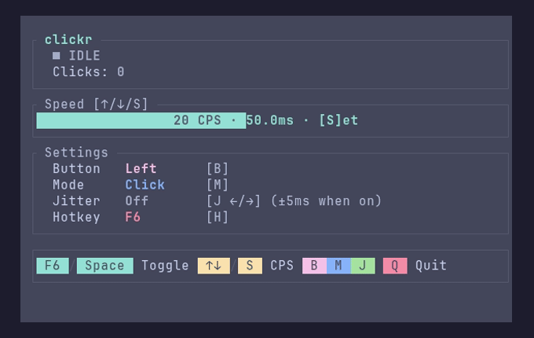

<div align="center">

# clickr

**Autoclicker for Linux with a TUI and a global hotkey.**<br>
Built for Wayland. Works on Hyprland, Sway, GNOME, KDE, X11, and everything else, because it drives a virtual mouse through the kernel instead of the display server.

[](https://github.com/Wavefire5201/clickr/releases/latest)
[](https://crates.io/crates/clickr)
[](https://aur.archlinux.org/packages/clickr-git)
[](https://github.com/Wavefire5201/clickr/actions/workflows/ci.yml)
[](LICENSE)



</div>

- **Any compositor.** Clicks come from a uinput virtual mouse, so no Wayland protocol, portal, or XWayland is involved.
- **Global hotkey.** F6 toggles from any window and keeps working when keyboards are unplugged or plugged in.
- **Everything in the TUI.** Speed from 1 to 1000 CPS, mouse button, click, double, or hold mode, jitter, and the hotkey itself.

## Install

```bash
yay -S clickr-git           # Arch Linux (AUR)
cargo install clickr        # crates.io, builds from source
cargo binstall clickr       # crates.io, downloads the prebuilt binary
```

Static binaries for x86_64 and aarch64 are attached to every [release](https://github.com/Wavefire5201/clickr/releases/latest) and run on any distribution. Or build from source with `cargo build --release`.

## Setup

clickr needs to be in the `input` group to read keyboards and create the virtual mouse. See [Security](#security) for what that grants.

```bash
sudo usermod -aG input $USER
```

Log out and back in. A notification daemon such as dunst, mako, or swaync is optional and enables the toggle popup.

## Usage

Run `clickr`, then:

| Key | Action |
|-----|--------|
| **F6** | Toggle on/off from any window |
| **Space** | Toggle on/off in the TUI |
| **Up/Down**, **S** | Adjust CPS, or type an exact value |
| **B** | Mouse button: left, right, middle |
| **M** | Mode: click, double, hold |
| **J**, **Left/Right** | Jitter on/off and amount |
| **H** | Hotkey: F6 to F12 |
| **R** | Reset click counter |
| **Q** | Quit |

## Security

Membership in the `input` group grants read and write access to every input device, keyboards included, plus write access to `/dev/uinput`. That is the same access a keylogger needs, and it is unavoidable: Wayland blocks input injection between clients by design, so kernel-level access is the only way an autoclicker can exist there. Only grant it to users you trust with full input access.

clickr limits what it does with that access. It refuses to run as root, setuid, setgid, or with file capabilities. It reacts only to F-keys and never logs other keys, and it marks itself non-dumpable so other processes cannot read its memory or produce a core dump of it. Its device is named `clickr virtual mouse`, and every button is released on exit, which the kernel also guarantees if the process is killed.

Packagers: install the binary with normal permissions and let users add themselves to `input`. Do not ship it setgid as a shortcut. clickr will refuse to start.

## Packaging

The `clickr-git` AUR package is maintained by [taxin-404](https://aur.archlinux.org/packages/clickr-git), who packaged clickr before it had a release. Thank you. A stable `clickr` package is planned. Flathub is not: a sandboxed app cannot open `/dev/uinput`. Packaging for another distribution? Open an issue and it will be linked here.

## License

[MIT](LICENSE)
